# dio-azure-essentials-virtual-machines
Parte do curso Microsoft Azure Essentials, oferecido pela DIO. Ensina como criar uma máquina virtual utilizando o Portal Azure. A máquina irá executar o Ubuntu Server 24.04 LTS - x64 Gen2.

## Passo 1:

Entrar no [portal do Azure](https://portal.azure.com/). 
Criar uma conta gratuita ou efetuar login.


## Passo 2:

Em search(procurar), procurar por Virtual Machines e acessar o primeiro resultado. Você será levado à sessão "Compute infrastructure | Virtual machines".
Selecione create(criar) e selecione a opção virtual machine.

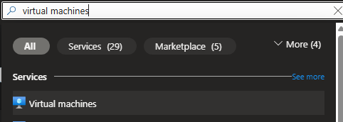
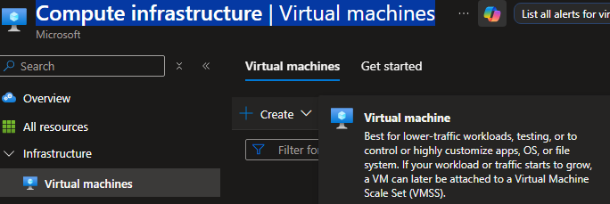


 ## Passo 3

 Criar um nome e o grupo de recursos associados à máquina. As outras opções podem ser deixadas como padrão. Selecione, em image(imagem) a opção Windows Server 2025 Datacenter - x64 Gen2 (free services eligible).
 
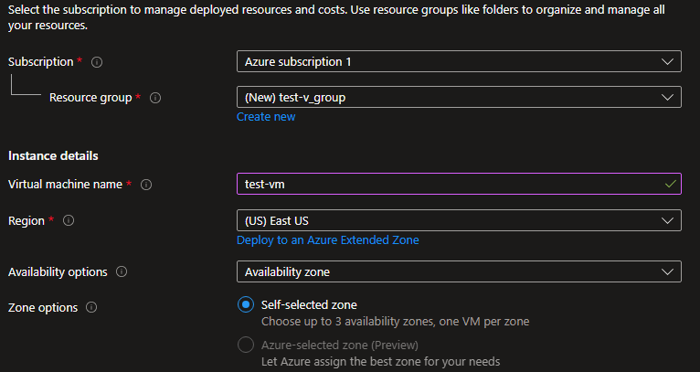


## Passo 4

Para fins de teste, você pode ativar a opção "Run with Azure Spot discount", que roda a sua máquina usando a capacidaded ociosa dos serviços Azure a preços muito menores. No entanto, a sua máquina pode ser interrompida a qualquer momento

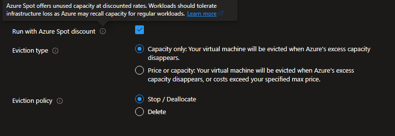

## Passo 5

Selecione um size compatível com os recursos disponibilizados pela conta gratuita.A opção padrão de escolha não é compatíveçl. Vá em "all sizes" e selecione a opção abaixo.


## Passo 6

Em administrator account selecione Password e entre com um nome de admin e senha, que deve ter no mínimo 12 caracteres e atender a requisitos de complexidade definidos.

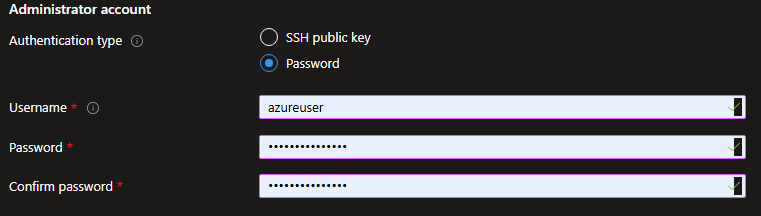

## Passo 7

Em Regras de porta de entrada, escolha Permitir portas selecionadas e, em seguida, selecione RDP (3389) e HTTP (80) na lista suspensa.

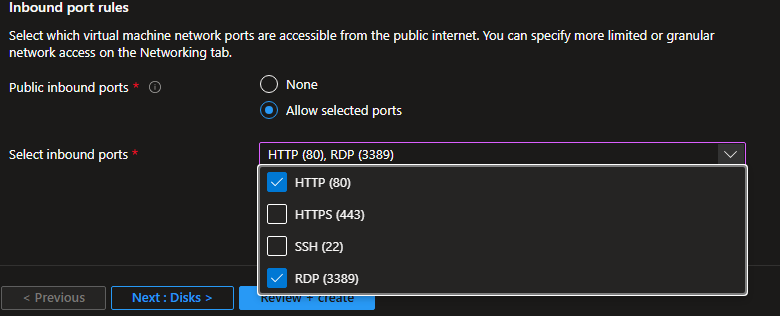

## Passo 8 

As outras opções podem ficar por padrão. Selecione review + create.

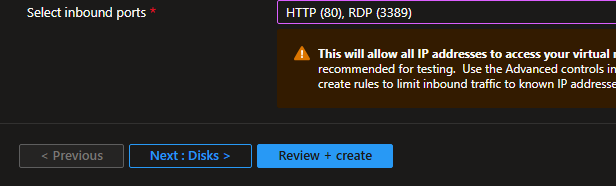

## Passo 9

Após a execução da validação, selecione o botão Criar(create) na parte inferior da página.

## Passo 10

Após o deployment (pode demorar um pouco) selecione "go to resouce"(ir para o recurso).

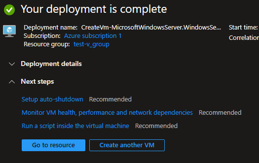

# Parte 2: conectar-se à máquina virtual usando Windows

## Passo 11

Selecione Conectar>RDP na página de Overview(visão geral) de sua máquina virtual.

## Passo 12

Na guia Conectar-se ao RDP, mantenha as opções padrão para se conectar por endereço IP pela porta 3389 e clique em download RDP file(baixar arquivo RDP).

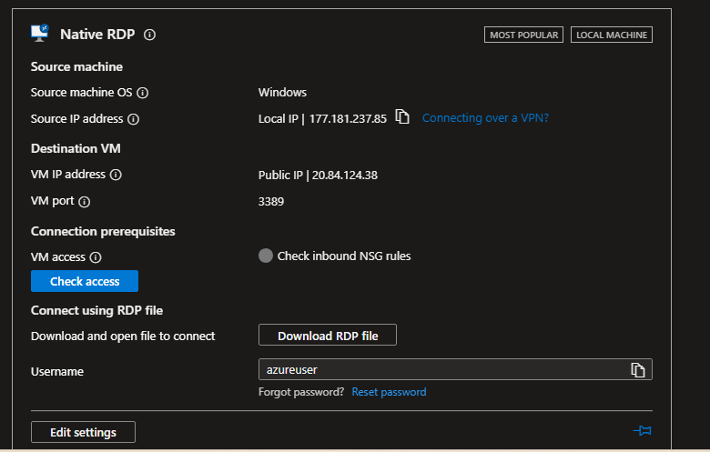

## Passo 13

Abra o arquivo RDP baixado e clique em Conectar quando solicitado. 
Na janela Segurança do Windows, selecione Mais opções e Usar uma conta diferente. Digite o nome de usuário como <i>localhost</i>t\nome de usuário, insira a senha que você criou para a máquina virtual e clique em OK.


## Passo 14

Você pode receber um aviso do certificado durante o processo de logon. Clique em Sim ou em Continuar para criar a conexão.

## Passo 15

Para ver a máquina em ação, é necessário instalar o servidor web do ISS dentro da máquina virtual. Abra um prompt do PowerShell na VM e execute o seguinte comando:

```
Install-WindowsFeature -name Web-Server -IncludeManagementTools
```

Fechar a conexão RDP com a VM quando terminar.

## Passo 16

Para localizar o IP da máquina virtual, maximize a tela da conexão remota ou vá no recurso da VM e identifique o item "Primary NIC public IP"

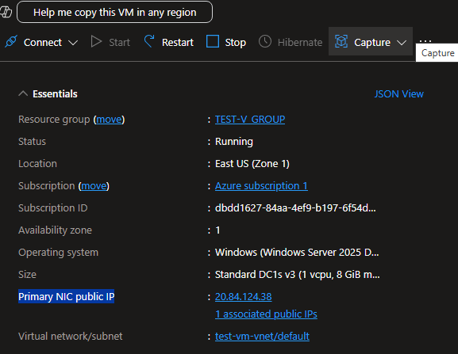


# Passo 17

Acesse esse IP via browser e veja a tela padrão de boas-vindas do ISS

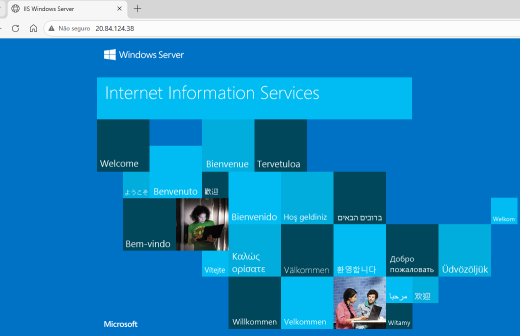

